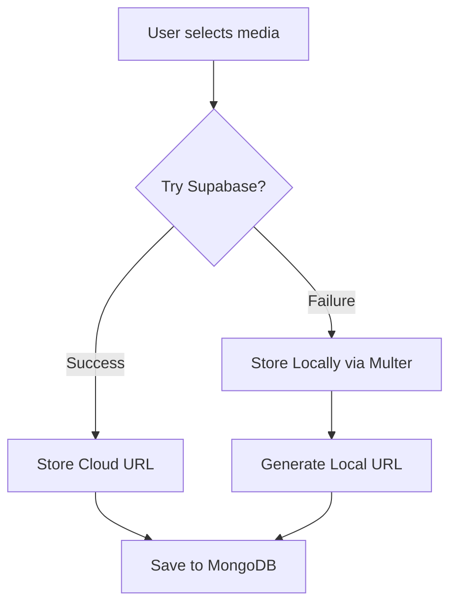

# Pulse — Night Mode Social Media Platform

<p align="center">
  
</p>

<p align="center">
  <strong>Frame your moments — elegant, nocturnal, unforgettable.</strong>
</p>

<p align="center">
  
  
  
  
  
</p>

---

## 🌟 Project Overview

**Pulse** is a high-fidelity, creator-focused social media sanctuary designed for those who prefer mood over noise. It provides a cinematic, photo-first experience where every still and micro-clip glows in a beautifully crafted dark interface.

Unlike generic platforms, Pulse prioritizes visual craft, offering a "nocturnal" aesthetic that matches the creative energy of photographers, digital artists, and filmmakers.

---

## 📸 Screenshots

| Landing Page | Dashboard |
| :--- | :--- |
|  |  |

| Messaging (Real-time) | Profile View |
| :--- | :--- |
|  |  |

---

## 🚀 Features

### 🔐 Authentication
- **Hybrid Auth Flow**: Secure JWT-based email/password registration and login.
- **Google OAuth**: One-tap access via Supabase Auth with automatic MongoDB user synchronization.
- **Protected Routes**: Fine-grained navigation control ensuring user privacy.

### 🎨 Social Ecosystem
- **Cinematic Feed**: Immersive, edge-to-edge layout for browsing creator moments.
- **Media Uploads**: Smart multi-image and short-form video support.
- **Creator Profiles**: Custom avatars, cover photos, and role-based badges (e.g., *Photographer*, *VFX Artist*).
- **Social Graph**: Smooth follow/unfollow system with mutual connection detection for messaging.
- **Engagements**: Real-time likes and deep-nested commenting system.

### 💬 Real-Time Messaging
- **Mutual Connectivity**: Private messaging enabled only for mutual followers.
- **Socket.io Integration**: Sub-50ms message delivery with unread status indicators and total counts.

### ☁️ Cloud & Resilience
- **Supabase Storage**: Primary cloud storage for high-availability media delivery.
- **Local Fallback**: Robust "Side-car" architecture that falls back to local disk storage if cloud providers are unreachable.

---

## 🏗️ Architecture Overview

Pulse is built using a modern **MERN** stack decoupled architecture, enhanced by Supabase cloud services.

### Frontend (React + Vite)
- **Pages**: Functional components with React Router for SPA navigation.
- **Components**: Atomic design with Tailwind CSS for consistent Pulse aesthetics.
- **API Layer**: Centralized `apiRequest` utility for JWT injection and error handling.

### Backend (Node.js + Express)
- **Controllers/Routes**: RESTful architecture with structured payload validation.
- **Middleware**: Custom `auth` guards for JWT validation and `socialSync` logic.
- **Realtime**: Socket.io server integrated into the Express lifecycle.

### Database (MongoDB + Mongoose)
- **Collections**: `Users`, `Posts`, `Follows`, `Messages`, `Likes`, `Comments`, `Blocks`.

---

## 📂 Folder Structure

```text
.
├── backend/                # Express Server Logic
│   ├── src/
│   │   ├── controllers/    # Business logic
│   │   ├── middleware/     # Auth & validation guards
│   │   ├── models/         # Mongoose schemas
│   │   ├── routes/         # API endpoints
│   │   └── lib/            # External initializations (Supabase, Mongo)
├── frontend/               # React Application (Vite)
│   ├── src/
│   │   ├── components/     # UI & Layout components
│   │   ├── pages/          # Full page views
│   │   ├── lib/            # API & Supabase clients
│   │   └── assets/         # Styles & static images
├── uploads/                # Local storage fallback directory
└── .gitignore              # Dependency & Env exclusions
```

---

## 🛠️ Installation Guide

### Prerequisites
- **Node.js**: v18.x or higher
- **MongoDB**: Local instance or Atlas URI
- **Supabase**: Account for Auth & Storage bucket (`posts`, `avatars`, `covers`)

### 1. Clone the repository
```bash
git clone https://github.com/yourusername/social-medai.git
cd social-medai
```

### 2. Backend Setup
```bash
cd backend
npm install
# Create .env based on the table below
npm run dev
```

### 3. Frontend Setup
```bash
cd ../frontend
npm install
# Create .env based on the table below
npm run dev
```

---

## 🔑 Environment Variables

### Backend (`backend/.env`)
| Variable | Description |
| :--- | :--- |
| `MONGO_URI` | MongoDB connection string |
| `JWT_SECRET` | Secret key for generating access tokens |
| `SUPABASE_URL` | Your Supabase project URL |
| `SUPABASE_SERVICE_ROLE_KEY` | **Secret** admin key (keep safe) |
| `PORT` | Local server port (default: 5000) |

### Frontend (`frontend/.env`)
| Variable | Description |
| :--- | :--- |
| `VITE_API_URL` | Backend URL (e.g., http://localhost:5000) |
| `VITE_SUPABASE_URL` | Your Supabase project URL |
| `VITE_SUPABASE_ANON_KEY` | Public client-side Supabase key |

---

## 🔄 Core Workflows

### Media Upload Flow


### Google OAuth Sync
1. User clicks **"Continue with Google"**.
2. Frontend signs in via `supabase.auth.signInWithOAuth`.
3. After redirect, frontend captures the `accessToken`.
4. Frontend hits `/api/auth/social-sync` with the token.
5. Backend verifies identity, creates/updates user in MongoDB, and issues a standard Pulse JWT.

---

## 📌 API Documentation (Highlights)

| Method | Endpoint | Description |
| :--- | :--- | :--- |
| **POST** | `/api/auth/social-sync` | Sync Supabase session with MongoDB |
| **GET** | `/api/posts` | Fetch chronological feed |
| **POST** | `/api/posts` | Create new moment (Supports Multipart) |
| **POST** | `/api/messages/thread/:id` | Send a private message |
| **GET** | `/api/users/search` | Dynamic creator search |

---

## 📑 Deployment Guide

1. **Frontend**: Deploy `frontend/` to **Vercel** or **Netlify**. Ensure `VITE_` variables are set in the provider dashboard.
2. **Backend**: Deploy `backend/` to **Render** or **Railway**. 
3. **Database**: Use **MongoDB Atlas** for managed cloud database.
4. **CORS**: Update `backend/src/index.js` to allow your production frontend origin.

---

## 🗺️ Roadmap
- [x] Responsive Pulse UI Refactor
- [x] Supabase Storage Integration
- [x] Google OAuth Implementation
- [ ] Notification System (Real-time)
- [ ] Story Highlights System
- [ ] Direct Video Calling

---

## 🛡️ Security
Pulse employs industry-standard security practices:
- **bcryptjs**: One-way hashing for all local user passwords.
- **JWT**: Stateless session management with 7-day expiration.
- **Admin Verification**: Supabase Service Role usage restricted to the backend.

---

## 📄 License
Distributed under the **MIT License**. See `LICENSE` for more information.

---

## ☕ Author
**Garvit Trivedi**  
*Senior Software Engineer & Pulse Creator*

[Follow on Pulse](#) • [GitHub](https://github.com/yourusername) • [LinkedIn](https://linkedin.com/in/yourusername)
